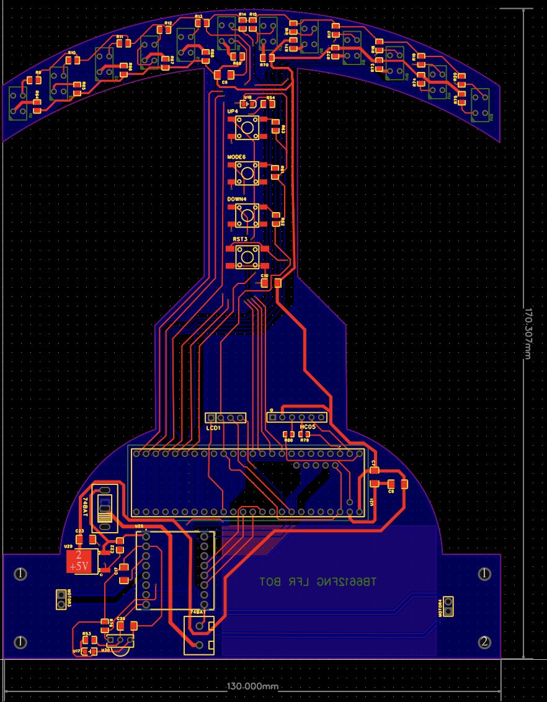
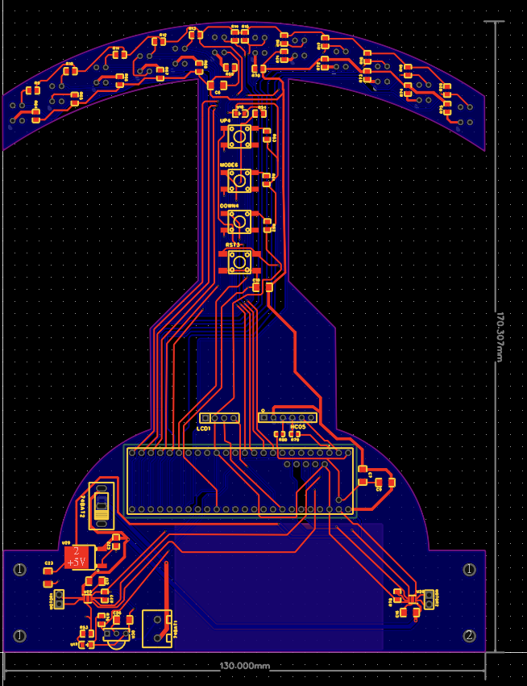
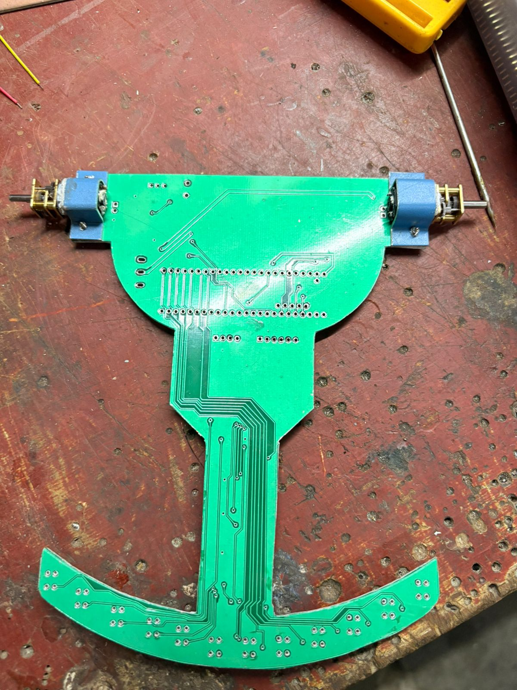

# Teensy 4.1 Line Follower Robot – Competition PCB

A custom-designed, fabricated, and tested PCB for a high-speed Line Follower Robot (LFR),
built around the Teensy 4.1 microcontroller and intended for competitive robotics use.

This repository contains **only the hardware design and fabrication assets**.
Firmware is intentionally not included.

---

## Overview

This project documents the design and fabrication of a competition-grade PCB
for a line follower robot, with emphasis on:

- reliable high-speed operation
- clean analog signal acquisition
- mechanical–electrical co-design
- on-board control and tuning during competitions

The PCB has been manufactured, assembled, and tested on a working robot.
Multiple hardware iterations were explored to evaluate different motor driver options.

---

## Key Features

- Teensy 4.1 based high-performance control board
- Curved front-mounted IR sensor array for wide and consistent line coverage
- Optimized analog routing for stable ADC readings
- On-board tactile buttons for mode selection and tuning
- Symmetric geometry for predictable motion behavior
- PCB designed to act as both control board and structural element
- Hardware tested in real-world line-following scenarios

---

## Motor Driver Variants

Two PCB variants were designed and fabricated to evaluate different motor driver
integrations while keeping the same overall geometry, sensor placement, and
mechanical constraints.

Both variants share:
- identical board outline and dimensions
- identical IR sensor array geometry
- identical Teensy 4.1 placement
- similar power and signal routing philosophy

---

### Variant A: TB6612FNG

- Motor Driver: TB6612FNG
- Proven and robust dual H-bridge driver
- Suitable for higher current margin applications
- Used in early competition testing

---

### Variant B: DRV8833

- Motor Driver: DRV8833
- Compact and efficient dual H-bridge driver
- Lower Rds(on) and improved thermal characteristics
- Evaluated as an alternative motor driver solution

---

## PCB Layouts

### TB6612FNG Variant – PCB Layout

---

### DRV8833 Variant – PCB Layout

---

## Assembled Hardware

### DRV8833 Variant – Assembled

#### DRV8833 PCB with SMD Components

#### DRV8833 PCB with Motors Mounted

---

## Side-by-Side Comparison (TB6612FNG vs DRV8833)

The following images show **both PCB variants in the same frame** for direct
visual comparison of routing, component placement, and mechanical alignment.

> **Note:**  
> Both the TB6612FNG and DRV8833 variants are visible in the same image.
> Differences are primarily limited to the motor driver section; the overall
> board geometry and sensor layout remain consistent.

### Front View (Both Variants)

### Back View (Both Variants)

---
# Hardware Design Files

This folder contains the complete hardware design files for the
Teensy 4.1 Line Follower Robot PCB.

## Contents

### Source Files
- EasyEDA project files (.epro) for both PCB variants
- These files can be opened and edited directly in EasyEDA

### Gerber Files
- Fabrication-ready Gerbers for both variants
- Can be uploaded directly to PCB manufacturers

## Variants
- TB6612FNG motor driver variant
- DRV8833 motor driver variant

## Notes
Verify connections, footprints, and component availability before fabrication.

## Fabrication

The PCB can be fabricated by directly uploading the provided Gerber files
to any standard PCB manufacturer (e.g., JLCPCB, PCBWay).

Recommended fabrication parameters:
- 2-layer board
- FR4 material
- 1.6 mm thickness
- Green solder mask

---

## Project Status

✔ PCB designed  
✔ PCB fabricated  
✔ Assembled and tested on robot  
✔ Multiple hardware variants evaluated  
✖ Firmware intentionally excluded  

---

## License

This project is released as **open hardware** under the  
**CERN Open Hardware Licence Version 2 – Permissive (CERN-OHL-P v2)**.

You are free to:
- manufacture the PCB
- modify the design
- use it in personal or academic projects

**Attribution to the original author is required.**

See the `LICENSE` file for full terms.

---

## Disclaimer

This hardware design is provided for educational and experimental purposes.
The author assumes no responsibility for damage, malfunction, or misuse.
Use at your own risk.
